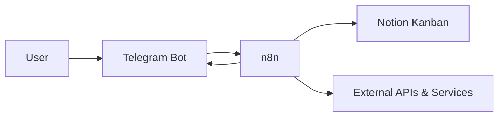

# Introduction

This project implements a lightweight automation platform using Telegram, n8n, and Notion.

Telegram acts as the primary input interface: messages and commands are captured by a Telegram Bot and processed by n8n workflows. The processed information is then used to automatically create and update items in a Notion Kanban board.

The platform is self-hosted and designed to remain simple, low-cost, secure, and easy to extend with additional automations.

# Requirements

The solution should:

- Use Telegram as the primary interface for capturing tasks and information.
- Use n8n Community Edition for workflow orchestration.
- Automatically create and update items in a Notion Kanban board.
- Support integrations with external APIs and AI services.
- Run on a low-cost, self-hosted VPS using Docker.
- Expose n8n securely over HTTPS through a reverse proxy.
- Keep credentials and API tokens outside source control.
- Provide persistent storage and backup capabilities.
- Remain simple to maintain and extend.

# Documentation

The documentation covers three areas:

- Build — architecture, infrastructure, n8n deployment, Telegram and Notion integration, and workflows.
- Run — operations, security, backups, upgrades, and troubleshooting.
- Architecture Decisions — significant technical decisions and their rationale.