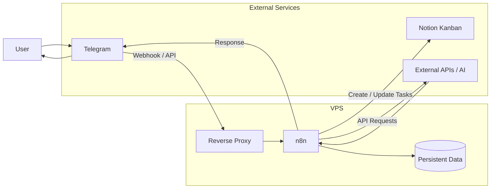
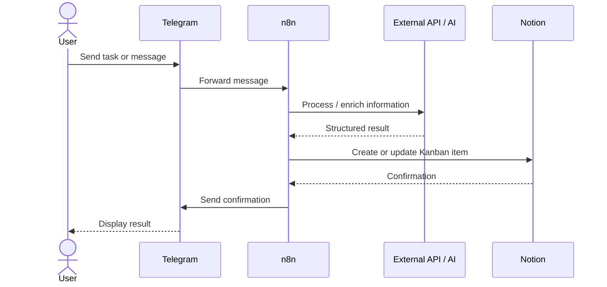
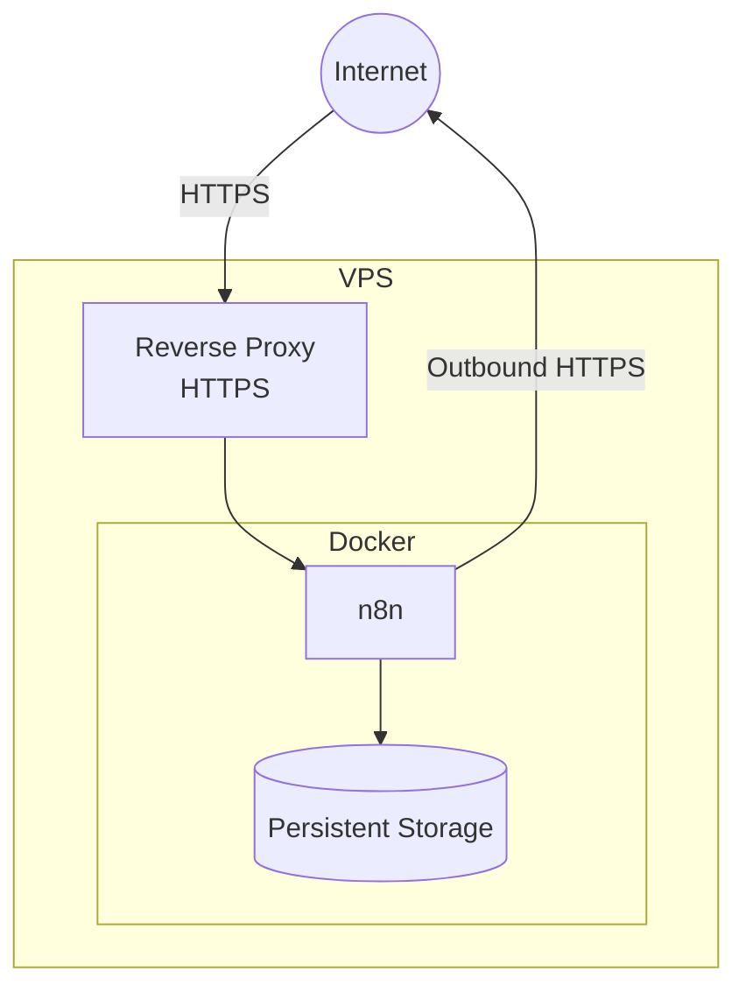
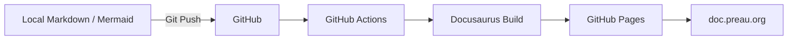

# Architecture overview

The platform follows a simple principle: **Telegram is the interface, n8n is the brain, and Notion is where the resulting tasks live.**

The architecture is intentionally lightweight. There is no need for a dedicated frontend or backend application: n8n handles the integration and orchestration between the different services.

## High-Level Architecture

## Main Components

| Component              | Role                                                         |
| ---------------------- | ------------------------------------------------------------ |
| **Telegram**           | Main interface used to send tasks, commands, and information |
| **Telegram Bot**       | Connects Telegram conversations to n8n                       |
| **n8n**                | Runs the automation logic and orchestrates integrations      |
| **Notion**             | Stores and organizes tasks in a Kanban board                 |
| **External APIs / AI** | Enrich or process information when needed                    |
| **Reverse Proxy**      | Securely exposes n8n over HTTPS                              |
| **Persistent Storage** | Keeps n8n configuration, credentials, and workflow data      |
| **VPS**                | Hosts the self-managed automation platform                   |

## Main Flow

A typical interaction starts with a message sent through Telegram.

The exact workflow can vary depending on the message, but the general pattern remains the same:

1. I send something to the Telegram Bot.
2. Telegram forwards the message to n8n.
3. n8n determines what to do with it.
4. External APIs or AI services can optionally process or enrich the information.
5. n8n creates or updates the corresponding item in the Notion Kanban.
6. Telegram can send a confirmation or result back to me.

## Hosting Architecture

n8n runs on a self-hosted VPS using Docker.

Only the reverse proxy needs to receive public web traffic.

n8n can then initiate outbound connections to services such as Telegram, Notion, and other APIs.

The detailed VPS, Docker, networking, DNS, and reverse proxy configuration is covered in the **Infrastructure** section.

## Design Principles

The architecture follows a few intentionally simple principles:

### Keep it simple

There is no custom application unless one becomes necessary. Existing services and n8n integrations are preferred over custom code.

### Keep components replaceable

Telegram, Notion, AI providers, and other external services should remain integrations rather than becoming tightly coupled to the core platform.

### Keep data persistent

Containers should be disposable. Configuration and important n8n data must survive container recreation and upgrades.

### Keep secrets out of Git

API tokens, Telegram credentials, Notion credentials, and other secrets must never be committed to the documentation or source repository.

### Automate where it makes sense

The goal isn't to automate everything. The goal is to remove repetitive manual work while keeping the system understandable and easy to maintain.

## Documentation Architecture

The documentation itself is deliberately separate from the automation infrastructure.

This means the documentation remains available even if the automation VPS is unavailable or being rebuilt.
