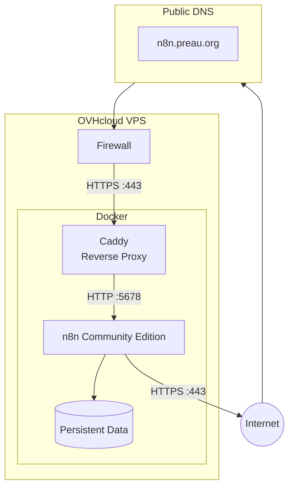
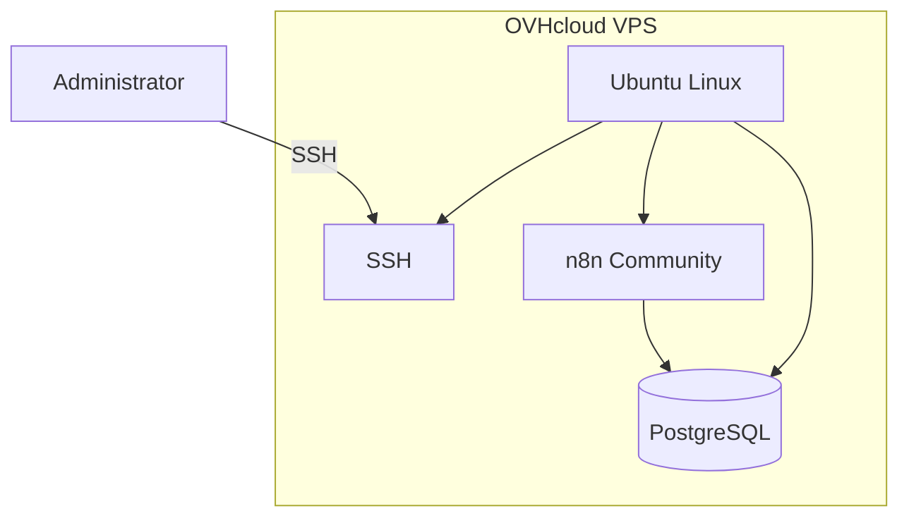
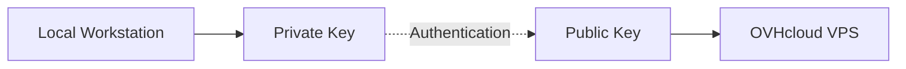
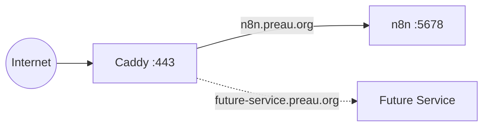
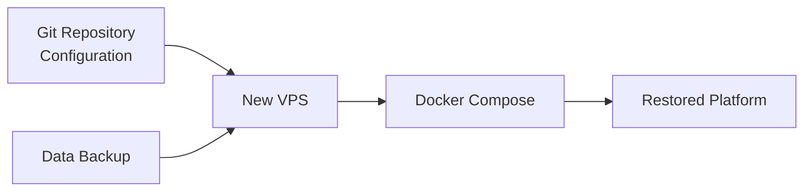

# Infrastructure

The automation platform runs on a small self-managed VPS.

The goal is to keep the infrastructure **simple, cheap, and easy to rebuild**. Most application components run as Docker containers, while the VPS mainly provides compute, networking, storage, and Docker itself.

## Infrastructure Overview



## Hosting

The platform is hosted on an **OVHcloud VPS**.

A VPS was preferred over n8n Cloud because I want to keep control over the environment, keep recurring costs low, and use this project as an opportunity to manage a small production-like infrastructure.

The VPS does not need significant resources. The initial workload consists mainly of a single n8n instance processing personal automation workflows.

| Resource         | Initial Target |
| ---------------- | -------------- |
| Provider         | OVHcloud       |
| Operating System | Ubuntu Server  |
| Architecture     | x86-64         |
| vCPU             | TBD            |
| Memory           | TBD            |
| Storage          | TBD            |
| Public IPv4      | Yes            |
| Backup           | TBD            |

The VPS size can be increased later if additional services are added.

## Network

Only services that need to be reachable from the Internet should be exposed publicly.

The initial network policy is:

| Port | Protocol | Purpose               | Public                         |
| ---: | -------- | --------------------- | ------------------------------ |
|   22 | TCP      | SSH administration    | Yes, restricted where possible |
|   80 | TCP      | HTTP / HTTPS redirect | Yes                            |
|  443 | TCP      | HTTPS                 | Yes                            |
| 5678 | TCP      | n8n                   | **No**                         |

n8n listens on its internal port `5678`, but this port is not exposed directly to the Internet.

External traffic reaches n8n through the reverse proxy.

```text
Internet
   ↓
TCP 443
   ↓
Caddy
   ↓
Docker network
   ↓
n8n:5678
```

## DNS

A dedicated DNS record will point the n8n hostname to the public IP address of the VPS.

```text
n8n.preau.org
      ↓
A record
      ↓
VPS public IPv4
```

This provides a stable hostname independently of the underlying application configuration.

## Reverse Proxy

**Caddy** is used as the public entry point for the platform.

Its responsibilities are:

* Listen for incoming HTTP and HTTPS requests.
* Manage TLS certificates automatically.
* Redirect HTTP traffic to HTTPS.
* Route requests to the appropriate Docker service.
* Keep internal application ports hidden from the public Internet.

Conceptually, the n8n configuration is very small:

```text
n8n.preau.org {
    reverse_proxy n8n:5678
}
```---

sidebar_position: 4
title: VPS Initial Setup
description: Initial setup of the OVHcloud VPS hosting n8n Community.
---------------------------------------------------------------------

# VPS Initial Setup

This page documents the initial setup of the OVHcloud VPS used to host the **n8n Community** automation platform.

At the end of this setup, the server provides:

* an up-to-date Ubuntu operating system;
* SSH key-based authentication;
* PostgreSQL;
* n8n Community.

## Architecture

At this stage, the architecture is intentionally simple:



This is the initial bootstrap architecture. Additional components such as Docker, a reverse proxy, HTTPS, backups, Telegram, and Notion will be introduced later.

---

## 1. VPS Provisioning

The VPS is hosted on **OVHcloud** with Ubuntu Linux as the operating system.

Once the VPS has been provisioned, OVHcloud provides the information required to access the server, including:

* the public IPv4 address;
* the initial administration account;
* the credentials required for the first SSH connection.

### Connect to the VPS

From a local terminal:

```bash
ssh <username>@<VPS_IP>
```

For example:

```bash
ssh ubuntu@203.0.113.10
```

During the first connection, SSH asks whether the server fingerprint should be trusted.

Confirm with:

```text
yes
```

### Validation

Check the installed operating system:

```bash
cat /etc/os-release
```

Check the hostname:

```bash
hostname
```

Check the server IP addresses:

```bash
hostname -I
```

---

## 2. System Update

Before installing application components, update the operating system and all installed packages.

### Update the package index

```bash
sudo apt update
```

This retrieves the latest package information from the repositories configured on the server.

### Install available updates

```bash
sudo apt upgrade -y
```

This installs available updates for packages already installed on the system.

### Reboot the server

After the initial system update:

```bash
sudo reboot
```

The SSH connection will be terminated while the server restarts.

Wait for the VPS to become available again and reconnect:

```bash
ssh <username>@<VPS_IP>
```

### Validation

Verify that the server is running:

```bash
uptime
```

Check whether additional package updates are available:

```bash
sudo apt update
apt list --upgradable
```

---

## 3. SSH Key Authentication

SSH key authentication provides a secure and convenient way to connect to the VPS without entering the server password for every connection.

The authentication mechanism works as follows:



The **private key remains exclusively on the local workstation**.

Only the public key is installed on the VPS.

### Generate an SSH key

On the local workstation:

```bash
ssh-keygen -t ed25519 -f ~/.ssh/ovh_n8n
```

`Ed25519` is a modern public-key signature algorithm based on elliptic-curve cryptography. It is generally preferred over RSA for new SSH keys because it provides strong security with smaller keys and good performance.

The name `25519` refers to the mathematical construction based on the prime number `2^255 - 19`.

The command creates two files:

```text
~/.ssh/ovh_n8n
~/.ssh/ovh_n8n.pub
```

The first file contains the **private key**.

The `.pub` file contains the **public key**.


This means that a request to:

```text
https://n8n.preau.org
```

is received by Caddy on port `443` and forwarded internally to n8n on port `5678`.

Caddy also makes it easy to expose additional services later using other hostnames.



## Docker

Application services run as Docker containers.

The initial container architecture is intentionally small:

```text
Docker
├── caddy
└── n8n
```

Both containers share a private Docker network so Caddy can reach n8n without exposing the n8n port publicly.

The setup will eventually be described using Docker Compose so that the complete application stack can be started with a simple command:

```bash
docker compose up -d
```

This also makes the infrastructure easier to reproduce if the VPS ever needs to be rebuilt.

## Persistent Data

Containers themselves are considered disposable.

Data that must survive container recreation or upgrades is stored using persistent Docker volumes.

At minimum, this includes:

* n8n configuration.
* Workflow definitions.
* Credentials managed by n8n.
* Execution-related data where required.
* Caddy configuration and certificate data.

The exact persistence and database strategy will be documented once implemented.

## Secrets

Secrets must never be stored directly in Git.

This includes:

* Telegram Bot tokens.
* Notion API credentials.
* n8n encryption keys.
* API keys.
* AI provider credentials.
* Other authentication tokens.

Runtime configuration will use environment variables and/or local environment files excluded from Git.

For example:

```text
.env
```

will be excluded through:

```text
.gitignore
```

Only safe configuration templates may be committed:

```text
.env.example
```

## Infrastructure as Code

The first version of the platform will favor simplicity over full Infrastructure as Code.

The VPS itself may initially be provisioned manually, while the application stack is defined through Docker Compose and documented here.

The goal is nevertheless to make the environment **rebuildable from documentation and configuration stored in Git**.

A future iteration could introduce tools such as Terraform or Ansible if the infrastructure becomes complex enough to justify them.

## Backup Strategy

The backup strategy still needs to be finalized.

At minimum, backups should cover the persistent data required to rebuild the n8n instance.

The general recovery principle is:



The objective is not necessarily to back up the entire VPS, but to make sure that **configuration + persistent data + documentation are enough to rebuild the platform**.