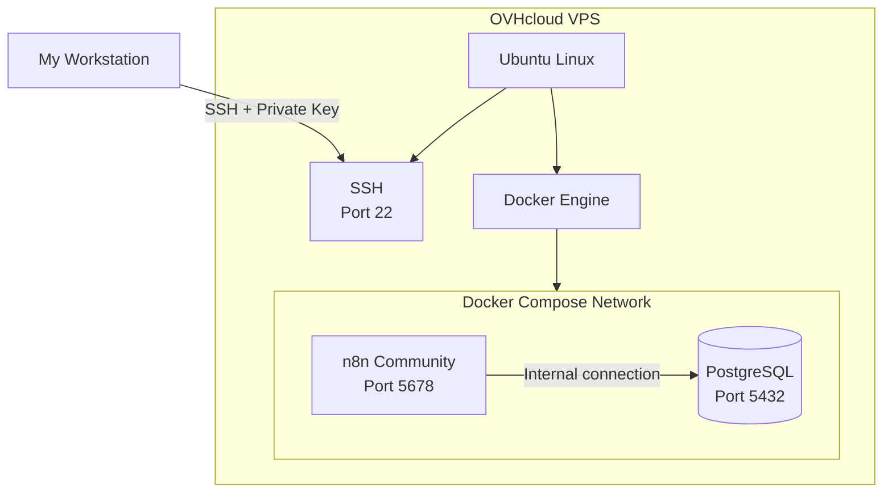
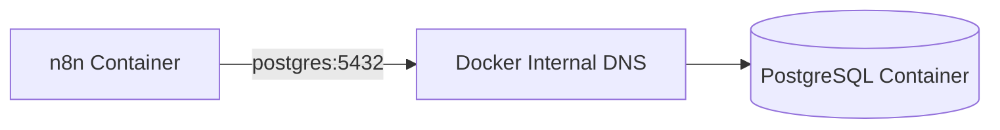
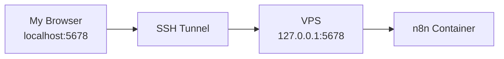
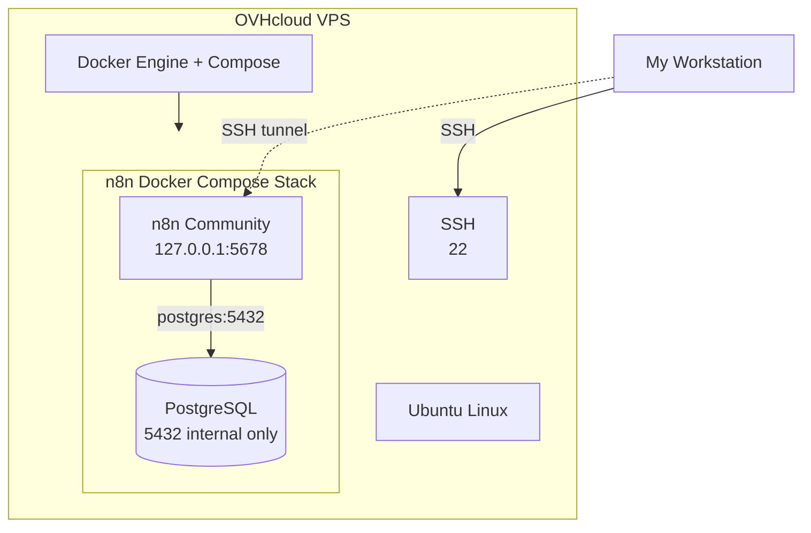
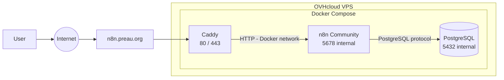
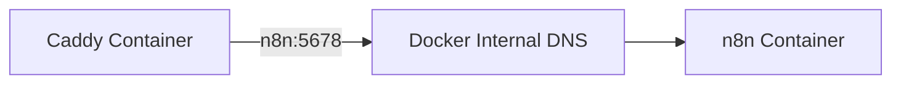
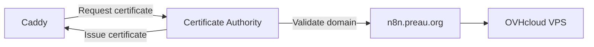
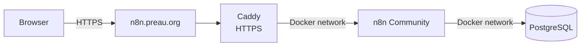

# VPS, Docker and n8n Setup

This page documents how I set up my **OVHcloud VPS** to host my **n8n Community** automation platform.

I chose a Docker-based architecture from the beginning. Both **n8n** and **PostgreSQL** run as containers managed by Docker Compose.

My initial target architecture is:



At this stage, neither PostgreSQL nor n8n needs to be directly exposed to the Internet.

I will add **Caddy**, DNS and HTTPS after validating that the application stack works correctly.

---

## 1. Provisioning the VPS

I provisioned an Ubuntu VPS on **OVHcloud**.

Once the VPS was available, I connected to it using SSH:

```bash
ssh <username>@<VPS_IP>
```

During the first connection, SSH asked me to confirm the server fingerprint.

I confirmed with:

```text
yes
```

I checked the operating system:

```bash
cat /etc/os-release
```

I also checked the hostname and IP addresses:

```bash
hostname
hostname -I
```

---

## 2. Updating Ubuntu

Before installing anything else, I updated the operating system.

First, I refreshed the package index:

```bash
sudo apt update
```

Then I installed the available updates:

```bash
sudo apt upgrade -y
```

After the initial update, I rebooted the VPS:

```bash
sudo reboot
```

My SSH connection was interrupted during the reboot.

Once the VPS was available again, I reconnected and checked that the system was running correctly:

```bash
uptime
```

I also checked for remaining updates:

```bash
sudo apt update
apt list --upgradable
```

---

## 3. Configuring SSH Key Authentication

To make SSH access both more convenient and more secure, I created a dedicated SSH key for this VPS.

On my local workstation, I generated an Ed25519 key:

```bash
ssh-keygen -t ed25519 -f ~/.ssh/ovh_n8n
```

`Ed25519` is a modern elliptic-curve signature algorithm commonly used for SSH authentication. It provides strong security with small keys and good performance.

The `25519` name comes from the underlying mathematical construction based on the prime number `2^255 - 19`.

The command created two files:

```text
~/.ssh/ovh_n8n
~/.ssh/ovh_n8n.pub
```

- `ovh_n8n` is my **private key**.
- `ovh_n8n.pub` is my **public key**.

:::warning

I keep the private key exclusively on my workstation.

I never copy it to the VPS, commit it to Git, or share it.

:::

### Installing the public key

I copied my public key to the VPS:

```bash
ssh-copy-id -i ~/.ssh/ovh_n8n.pub <username>@<VPS_IP>
```

The public key is stored on the VPS in:

```text
~/.ssh/authorized_keys
```

I then tested the connection explicitly with my new key:

```bash
ssh -i ~/.ssh/ovh_n8n <username>@<VPS_IP>
```

---

## 4. Creating an SSH Alias

To avoid typing the IP address and key path every time, I configured my local SSH client.

I edited:

```bash
nano ~/.ssh/config
```

and added:

```text
Host n8n-vps
    HostName <VPS_IP>
    User <username>
    IdentityFile ~/.ssh/ovh_n8n
```

I can now connect simply with:

```bash
ssh n8n-vps
```

---

## 5. Why I Chose Docker

I decided not to install PostgreSQL and n8n directly on Ubuntu.

Instead, Ubuntu only provides the operating system and Docker runtime.

My application services run inside containers:

```text
Ubuntu
└── Docker
    └── Docker Compose
        ├── PostgreSQL
        └── n8n Community
```

This gives me:

- a reproducible application stack;
- explicit service configuration;
- service isolation;
- simpler upgrades;
- persistent volumes separated from containers;
- easier backup and restoration;
- a clean path for adding Caddy later.

---

## 6. Installing Docker Engine

I installed Docker Engine from Docker's official Ubuntu repository.

### Installing the prerequisites

```bash
sudo apt update
sudo apt install ca-certificates curl -y
```

### Adding Docker's GPG key

```bash
sudo install -m 0755 -d /etc/apt/keyrings
sudo curl -fsSL https://download.docker.com/linux/ubuntu/gpg \
  -o /etc/apt/keyrings/docker.asc
sudo chmod a+r /etc/apt/keyrings/docker.asc
```

### Adding the Docker repository

```bash
sudo tee /etc/apt/sources.list.d/docker.sources <<EOF
Types: deb
URIs: https://download.docker.com/linux/ubuntu
Suites: $(. /etc/os-release && echo "${UBUNTU_CODENAME:-$VERSION_CODENAME}")
Components: stable
Architectures: $(dpkg --print-architecture)
Signed-By: /etc/apt/keyrings/docker.asc
EOF
```

I refreshed the package index:

```bash
sudo apt update
```

### Installing Docker and Docker Compose

```bash
sudo apt install \
  docker-ce \
  docker-ce-cli \
  containerd.io \
  docker-buildx-plugin \
  docker-compose-plugin \
  -y
```

Docker Compose is installed as a Docker CLI plugin.

I therefore use:

```bash
docker compose
```

instead of the legacy:

```text
docker-compose
```

### Validating the installation

I checked the versions:

```bash
sudo docker --version
sudo docker compose version
```

I then ran Docker's test container:

```bash
sudo docker run hello-world
```

A successful execution displayed:

```text
Hello from Docker!
```

---

## 7. Allowing My User to Run Docker

By default, my user did not have permission to access the Docker daemon.

I added my user to the `docker` group:

```bash
sudo usermod -aG docker $USER
```

I then completely disconnected from the SSH session:

```bash
exit
```

and reconnected:

```bash
ssh n8n-vps
```

I checked my groups:

```bash
groups
```

The `docker` group should appear in the result.

I then validated access to Docker without `sudo`:

```bash
docker ps
```

### Permission denied troubleshooting

Before reconnecting, I encountered an error similar to:

```text
permission denied while trying to connect to the Docker API at unix:///var/run/docker.sock
```

The reason was that my current SSH session had not yet picked up my new membership in the `docker` group.

Logging out and reconnecting fixed the problem.

If necessary, I can also activate the group in the current session with:

```bash
newgrp docker
```

I can inspect the Docker socket permissions with:

```bash
ls -l /var/run/docker.sock
```

The socket should normally belong to:

```text
root docker
```

:::warning

Membership in the `docker` group effectively provides root-level control over the host.

I therefore only grant Docker group membership to trusted administration accounts.

:::

---

## 8. Creating the n8n Application Directory

I store the Docker Compose application stack under:

```text
/opt/n8n
```

I created the directory:

```bash
sudo mkdir -p /opt/n8n
sudo chown $USER:$USER /opt/n8n
cd /opt/n8n
```

I verified my current directory:

```bash
pwd
```

Expected result:

```text
/opt/n8n
```

---

## 9. Creating the Configuration Files

My application directory contains two main configuration files:

```text
/opt/n8n/
├── compose.yaml
└── .env
```

I created the environment file with:

```bash
nano .env
```

and the Docker Compose file with:

```bash
nano compose.yaml
```

`nano` automatically creates the files if they do not already exist.

The `.env` file starts with a dot and is therefore hidden by default on Linux.

To display it, I use:

```bash
ls -la
```

rather than:

```bash
ls
```

---

## 10. Configuring Application Secrets

I use `.env` to keep environment-specific configuration and secrets separate from `compose.yaml`.

### Generating the PostgreSQL password

I generated a strong random password:

```bash
openssl rand -base64 32
```

### Generating the n8n encryption key

I generated a separate encryption key:

```bash
openssl rand -hex 32
```

I then edited:

```bash
nano /opt/n8n/.env
```

with:

```dotenv
# PostgreSQL
POSTGRES_DB=n8n
POSTGRES_USER=n8n
POSTGRES_PASSWORD=<GENERATED_POSTGRES_PASSWORD>

# n8n
N8N_ENCRYPTION_KEY=<GENERATED_N8N_ENCRYPTION_KEY>

# Timezone
GENERIC_TIMEZONE=Europe/Paris
TZ=Europe/Paris
```

I restricted access to the file:

```bash
chmod 600 /opt/n8n/.env
```

:::danger

My `.env` file contains secrets.

I do not commit it to Git or publish it in my Docusaurus repository.

The `N8N_ENCRYPTION_KEY` must also be backed up securely. n8n uses this key to encrypt stored credentials.

:::

For Git, I can later create a `.env.example` containing only placeholders.

---

## 11. Deploying PostgreSQL with Docker Compose

I chose PostgreSQL as the n8n database instead of using SQLite.

PostgreSQL runs entirely inside Docker and is not installed directly on Ubuntu.

I initially configured PostgreSQL alone so that I could validate the database independently before introducing n8n.

I edited:

```bash
nano /opt/n8n/compose.yaml
```

with:

```yaml
services:
  postgres:
    image: postgres:17
    restart: unless-stopped

    environment:
      POSTGRES_DB: ${POSTGRES_DB}
      POSTGRES_USER: ${POSTGRES_USER}
      POSTGRES_PASSWORD: ${POSTGRES_PASSWORD}

    volumes:
      - postgres_data:/var/lib/postgresql/data

    healthcheck:
      test:
        [
          "CMD-SHELL",
          "pg_isready -U ${POSTGRES_USER} -d ${POSTGRES_DB}"
        ]
      interval: 10s
      timeout: 5s
      retries: 5

volumes:
  postgres_data:
```

### Why I do not expose port 5432

There is intentionally no:

```yaml
ports:
  - "5432:5432"
```

in the PostgreSQL configuration.

PostgreSQL does not need to be accessible from the Internet or directly from the VPS public network.

Docker Compose provides an internal network that will allow n8n to communicate with PostgreSQL.

---

## 12. Validating the Compose Configuration

Before starting the service, I validated the configuration:

```bash
cd /opt/n8n
docker compose config
```

If the YAML is valid, Docker Compose renders the resolved configuration.

:::warning

`docker compose config` resolves values from `.env` and may display secrets in the terminal.

I do not copy this output into documentation, tickets, logs, or Git.

:::

---

## 13. Starting PostgreSQL

I downloaded the PostgreSQL image:

```bash
docker compose pull
```

Then I started the service:

```bash
docker compose up -d
```

The `-d` option runs the container in detached mode.

I checked its status:

```bash
docker compose ps
```

After initialization, PostgreSQL should report a healthy state.

I can inspect its logs with:

```bash
docker compose logs postgres
```

---

## 14. Validating PostgreSQL

I opened a PostgreSQL session directly inside the container:

```bash
docker compose exec postgres psql -U n8n -d n8n
```

I verified the current database:

```sql
SELECT current_database();
```

Expected result:

```text
n8n
```

I exited PostgreSQL with:

```sql
\q
```

At this point, I had validated the database layer independently from n8n.

---

## 15. Adding n8n to Docker Compose

Once PostgreSQL was working, I added n8n to the same Compose stack.

My complete `compose.yaml` became:

```yaml
services:
  postgres:
    image: postgres:17
    restart: unless-stopped

    environment:
      POSTGRES_DB: ${POSTGRES_DB}
      POSTGRES_USER: ${POSTGRES_USER}
      POSTGRES_PASSWORD: ${POSTGRES_PASSWORD}

    volumes:
      - postgres_data:/var/lib/postgresql/data

    healthcheck:
      test:
        [
          "CMD-SHELL",
          "pg_isready -U ${POSTGRES_USER} -d ${POSTGRES_DB}"
        ]
      interval: 10s
      timeout: 5s
      retries: 5

  n8n:
    image: docker.n8n.io/n8nio/n8n:latest
    restart: unless-stopped

    depends_on:
      postgres:
        condition: service_healthy

    ports:
      - "127.0.0.1:5678:5678"

    environment:
      DB_TYPE: postgresdb
      DB_POSTGRESDB_HOST: postgres
      DB_POSTGRESDB_PORT: 5432
      DB_POSTGRESDB_DATABASE: ${POSTGRES_DB}
      DB_POSTGRESDB_USER: ${POSTGRES_USER}
      DB_POSTGRESDB_PASSWORD: ${POSTGRES_PASSWORD}

      N8N_ENCRYPTION_KEY: ${N8N_ENCRYPTION_KEY}

      GENERIC_TIMEZONE: ${GENERIC_TIMEZONE}
      TZ: ${TZ}

    volumes:
      - n8n_data:/home/node/.n8n

volumes:
  postgres_data:
  n8n_data:
```

---

## 16. How n8n Connects to PostgreSQL

The important configuration is:

```yaml
DB_POSTGRESDB_HOST: postgres
```

`postgres` is not an external hostname.

It is the name of the PostgreSQL service declared in:

```yaml
services:
  postgres:
```

Docker Compose creates a private network and provides internal DNS resolution between the services.

The communication therefore looks like:



I do not need to assign static IP addresses to the containers.

---

## 17. Why I Bind n8n to 127.0.0.1

During the bootstrap phase, I configured:

```yaml
ports:
  - "127.0.0.1:5678:5678"
```

This makes n8n available on:

```text
127.0.0.1:5678
```

on the VPS, but not directly on the VPS public IP.

Conceptually:

```text
Internet
   |
   X  VPS_PUBLIC_IP:5678

VPS
   |
   +--> 127.0.0.1:5678
             |
             +--> n8n container
```

This allows me to validate n8n without exposing an unencrypted HTTP endpoint to the Internet.

Caddy will later become the public entry point.

---

## 18. Starting n8n

After updating `compose.yaml`, I validated the configuration again:

```bash
docker compose config
```

I downloaded the required images:

```bash
docker compose pull
```

Then I started the complete stack:

```bash
docker compose up -d
```

I checked both services:

```bash
docker compose ps
```

The expected state is conceptually:

```text
SERVICE      STATUS
postgres     Up (healthy)
n8n          Up
```

I inspected the n8n logs with:

```bash
docker compose logs -f n8n
```

I use `Ctrl+C` to stop following the logs without stopping the container.

---

## 19. Validating n8n Locally

From the VPS, I can check that n8n responds locally:

```bash
curl -I http://127.0.0.1:5678
```

A valid HTTP response confirms that the n8n service is listening.

---

## 20. Accessing n8n Through an SSH Tunnel

Because n8n is not publicly exposed yet, I use an SSH tunnel from my workstation.

From my **local workstation**, I run:

```bash
ssh -L 5678:127.0.0.1:5678 n8n-vps
```

The connection works as follows:



While keeping the SSH session open, I access:

```text
http://localhost:5678
```

from my local browser.

This allows me to initialize and validate n8n before configuring the public HTTPS endpoint.

---

## 21. Persistent Data

I use two Docker named volumes:

```text
postgres_data
n8n_data
```

Their roles are:

| Volume | Purpose |
|---|---|
| `postgres_data` | PostgreSQL database files |
| `n8n_data` | n8n application data and local configuration |

I can list Docker volumes with:

```bash
docker volume ls
```

Containers and persistent data have separate lifecycles.

For example:

```bash
docker compose down
```

removes the containers and Compose network but keeps the named volumes.

I can recreate the stack with:

```bash
docker compose up -d
```

without deleting the application data.

:::danger

I avoid using:

```text
docker compose down -v
```

unless I explicitly want to remove the persistent volumes.

The `-v` option can delete my PostgreSQL and n8n persistent data.

:::

---

## 22. Current Architecture

At the end of this phase, my architecture is:



The important security properties at this point are:

- PostgreSQL is not exposed publicly;
- n8n is not exposed publicly;
- PostgreSQL and n8n communicate through Docker's internal network;
- persistent data is stored in Docker volumes;
- secrets are kept in `.env`;
- administrative access uses SSH keys.

---

## 23. Useful Commands

### Check the stack

```bash
docker compose ps
```

### Follow all logs

```bash
docker compose logs -f
```

### Follow n8n logs

```bash
docker compose logs -f n8n
```

### Follow PostgreSQL logs

```bash
docker compose logs -f postgres
```

### Stop the services

```bash
docker compose stop
```

### Start the services

```bash
docker compose start
```

### Restart n8n

```bash
docker compose restart n8n
```

### Recreate the stack

```bash
docker compose down
docker compose up -d
```

### Download newer images

```bash
docker compose pull
```

---

## 24. Configuring DNS, Caddy and HTTPS

Once PostgreSQL and n8n were running correctly inside Docker, I configured the public access layer.

I deliberately added this layer **after validating n8n locally** so that I could validate the architecture incrementally:

```text
Ubuntu
  ↓
Docker
  ↓
PostgreSQL
  ↓
n8n
  ↓
DNS
  ↓
Caddy
  ↓
HTTPS
```

Caddy acts as the **reverse proxy** between the Internet and n8n.

The target architecture becomes:



Only Caddy is exposed to the Internet.

n8n and PostgreSQL remain internal Docker services.

---

## 26. Configuring the DNS Record

I use the following public hostname for n8n:

```text
n8n.preau.org
```

In the DNS zone for `preau.org`, I created an **A record** pointing the `n8n` subdomain to the public IPv4 address of my OVHcloud VPS:

```text
Type:      A
Subdomain: n8n
Target:    <VPS_PUBLIC_IP>
```

Conceptually:

```text
n8n.preau.org
      |
      v
<VPS_PUBLIC_IP>
```

### Validating DNS Resolution

From my local workstation, I checked the record with:

```bash
dig n8n.preau.org
```

Alternatively:

```bash
nslookup n8n.preau.org
```

The returned IP address must match the public IP address of my VPS.

I only continued with the HTTPS configuration once DNS resolution was working correctly.

---

## 27. Opening HTTP and HTTPS Ports

Caddy needs to receive incoming HTTP and HTTPS traffic.

The required public ports are:

| Port | Protocol | Purpose |
|---|---|---|
| `22` | TCP | SSH administration |
| `80` | TCP | HTTP and certificate validation |
| `443` | TCP | HTTPS |
| `443` | UDP | HTTP/3 support |

If UFW is enabled, I allow HTTP and HTTPS traffic with:

```bash
sudo ufw allow 80/tcp
sudo ufw allow 443/tcp
```

I then verify the firewall configuration:

```bash
sudo ufw status
```

I do **not** expose PostgreSQL port `5432`.

Once Caddy becomes the public entry point, I also no longer expose n8n port `5678` on the VPS.

---

## 28. Creating the Caddy Configuration Directory

My application stack is located under:

```text
/opt/n8n
```

I created a dedicated directory for Caddy:

```bash
cd /opt/n8n
mkdir -p caddy
```

The application directory now contains:

```text
/opt/n8n/
├── .env
├── compose.yaml
└── caddy/
    └── Caddyfile
```

---

## 29. Creating the Caddyfile

I created the Caddy configuration file:

```bash
nano /opt/n8n/caddy/Caddyfile
```

with:

```caddyfile
n8n.preau.org {
    reverse_proxy n8n:5678
}
```

When a request arrives for:

```text
https://n8n.preau.org
```

Caddy forwards it internally to:

```text
n8n:5678
```

### Why `n8n:5678` Instead of `localhost:5678`

Caddy and n8n run in separate containers.

Inside the Caddy container, `localhost` refers to the **Caddy container itself**, not to the VPS and not to the n8n container.

Docker Compose provides internal DNS resolution based on service names.

Because my Compose configuration contains:

```yaml
services:
  n8n:
```

Caddy can reach n8n using:

```text
n8n:5678
```

The communication therefore looks like:



No static container IP address is required.

---

## 30. Configuring n8n for the Reverse Proxy

Because n8n now runs behind Caddy, I configured n8n with its public URL.

I added the following environment variables to the `n8n` service:

```yaml
N8N_HOST: n8n.preau.org
N8N_PROTOCOL: https
WEBHOOK_URL: https://n8n.preau.org/
N8N_PROXY_HOPS: 1
```

These settings tell n8n that its public address is:

```text
https://n8n.preau.org
```

even though internally it still listens on:

```text
n8n:5678
```

This is particularly important for integrations such as Telegram, which need n8n to generate externally reachable webhook URLs.

### Proxy Hop Configuration

My request path is:

```text
Internet
   ↓
Caddy
   ↓
n8n
```

There is one reverse proxy between the client and n8n.

I therefore configure:

```text
N8N_PROXY_HOPS=1
```

---

## 31. Adding Caddy to Docker Compose

I added Caddy as a third service in my Docker Compose stack.

My architecture now contains:

```text
Docker Compose
├── postgres
├── n8n
└── caddy
```

My `compose.yaml` becomes:

```yaml
services:

  postgres:
    image: postgres:17
    restart: unless-stopped

    environment:
      POSTGRES_DB: ${POSTGRES_DB}
      POSTGRES_USER: ${POSTGRES_USER}
      POSTGRES_PASSWORD: ${POSTGRES_PASSWORD}

    volumes:
      - postgres_data:/var/lib/postgresql/data

    healthcheck:
      test:
        [
          "CMD-SHELL",
          "pg_isready -U ${POSTGRES_USER} -d ${POSTGRES_DB}"
        ]
      interval: 10s
      timeout: 5s
      retries: 5

  n8n:
    image: docker.n8n.io/n8nio/n8n:latest
    restart: unless-stopped

    depends_on:
      postgres:
        condition: service_healthy

    environment:
      DB_TYPE: postgresdb
      DB_POSTGRESDB_HOST: postgres
      DB_POSTGRESDB_PORT: 5432
      DB_POSTGRESDB_DATABASE: ${POSTGRES_DB}
      DB_POSTGRESDB_USER: ${POSTGRES_USER}
      DB_POSTGRESDB_PASSWORD: ${POSTGRES_PASSWORD}

      N8N_ENCRYPTION_KEY: ${N8N_ENCRYPTION_KEY}

      GENERIC_TIMEZONE: ${GENERIC_TIMEZONE}
      TZ: ${TZ}

      N8N_HOST: n8n.preau.org
      N8N_PROTOCOL: https
      WEBHOOK_URL: https://n8n.preau.org/
      N8N_PROXY_HOPS: 1

    volumes:
      - n8n_data:/home/node/.n8n

  caddy:
    image: caddy:2
    restart: unless-stopped

    depends_on:
      - n8n

    ports:
      - "80:80"
      - "443:443"
      - "443:443/udp"

    volumes:
      - ./caddy/Caddyfile:/etc/caddy/Caddyfile:ro
      - caddy_data:/data
      - caddy_config:/config

volumes:
  postgres_data:
  n8n_data:
  caddy_data:
  caddy_config:
```

---

## 32. Removing the Temporary n8n Port Mapping

Before Caddy was installed, I temporarily exposed n8n only on the VPS loopback interface:

```yaml
ports:
  - "127.0.0.1:5678:5678"
```

This allowed me to access n8n through an SSH tunnel.

Once Caddy became part of the Docker Compose network, I removed this mapping.

n8n no longer needs a host port.

The traffic now follows:

```text
Internet
   |
   | HTTPS :443
   v
Caddy
   |
   | Docker internal network
   v
n8n :5678
```

This reduces the public attack surface of the VPS.

---

## 33. Persisting Caddy Data

I configured two persistent volumes for Caddy:

```yaml
caddy_data:
caddy_config:
```

They are mounted as:

```yaml
- caddy_data:/data
- caddy_config:/config
```

The `/data` volume is particularly important because Caddy stores information related to TLS certificates and its certificate management state there.

This state remains available when the Caddy container is recreated.

---

## 34. Validating the Docker Compose Configuration

Before starting the updated stack, I validate it with:

```bash
cd /opt/n8n
docker compose config
```

This verifies that Docker Compose can correctly parse and resolve the configuration.

:::warning

This command may display secrets resolved from my `.env` file.

I do not copy its output into documentation, tickets, or public logs.

:::

---

## 35. Validating the Caddy Configuration

I can validate my Caddyfile before starting the complete stack:

```bash
docker run --rm \
  -v "$PWD/caddy/Caddyfile:/etc/caddy/Caddyfile:ro" \
  caddy:2 \
  caddy validate --config /etc/caddy/Caddyfile
```

The configuration should validate without errors.

---

## 36. Starting Caddy

I downloaded the required Docker images:

```bash
docker compose pull
```

Then I applied the updated configuration:

```bash
docker compose up -d
```

Docker Compose creates or updates the required containers while keeping the persistent volumes.

I checked the stack:

```bash
docker compose ps
```

I expect three services:

```text
postgres
n8n
caddy
```

with PostgreSQL reporting a healthy state.

---

## 37. Automatic HTTPS

One of the reasons I chose Caddy is its automatic HTTPS capability.

Because my Caddyfile contains a public hostname:

```text
n8n.preau.org
```

Caddy automatically attempts to obtain a trusted TLS certificate for that hostname.

The process is conceptually:



For this to work:

- `n8n.preau.org` must resolve to my VPS;
- ports `80` and `443` must be reachable;
- Caddy must be running.

Caddy stores its certificate-related state in the persistent `caddy_data` volume and automatically handles certificate renewal.

---

## 38. Monitoring Caddy

During the first startup, I inspect the Caddy logs:

```bash
docker compose logs -f caddy
```

This lets me see:

- Caddy startup;
- configuration loading;
- certificate requests;
- ACME validation;
- TLS certificate installation;
- potential DNS or network errors.

I use `Ctrl+C` to stop following the logs without stopping Caddy.

---

## 39. Testing HTTP

From my workstation, I test:

```bash
curl -I http://n8n.preau.org
```

Caddy normally redirects HTTP traffic to HTTPS.

A typical response is:

```text
HTTP/1.1 308 Permanent Redirect
Location: https://n8n.preau.org/
```

This ensures that normal application traffic uses an encrypted HTTPS connection.

---

## 40. Testing HTTPS

I then test:

```bash
curl -I https://n8n.preau.org
```

Finally, I open:

```text
https://n8n.preau.org
```

in my browser.

The n8n interface should load using a trusted HTTPS certificate.

At this point, the public request flow is:



---

## 41. Resulting Security Model

At the end of this phase:

| Component | Publicly Accessible | Port |
|---|---|---|
| SSH | Yes | `22` |
| Caddy HTTP | Yes | `80` |
| Caddy HTTPS | Yes | `443` |
| n8n | No | `5678` internal |
| PostgreSQL | No | `5432` internal |

The application is now exposed through a single controlled entry point:

```text
Internet
   ↓
HTTPS
   ↓
Caddy
   ↓
n8n
   ↓
PostgreSQL
```

Caddy is responsible for:

- accepting public HTTP/HTTPS connections;
- redirecting HTTP to HTTPS;
- managing TLS certificates;
- renewing certificates automatically;
- terminating TLS;
- forwarding requests to n8n.

n8n and PostgreSQL remain isolated inside the Docker Compose network.

---

## 42. Next Steps

With the public HTTPS endpoint available, the infrastructure is ready for the application integrations.

The next steps are:

1. validate the n8n owner account and application settings;
2. configure the Telegram bot credentials;
3. configure the Telegram webhook;
4. configure the Notion integration;
5. create the first Telegram → n8n → Notion workflow;
6. define the backup strategy;
7. test PostgreSQL restoration;
8. securely back up the n8n encryption key;
9. define the n8n upgrade procedure;
10. add basic monitoring.

The infrastructure now provides the foundation required for externally triggered automation workflows.