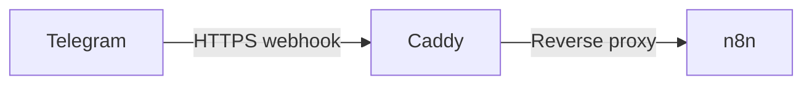
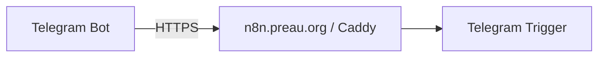

# Telegram Webhook Setup

With my n8n instance now publicly available over HTTPS, the next step in my automation project is to make sure Telegram can call n8n correctly.

This page documents the small but important configuration change I made to ensure that n8n generates webhook URLs using my public domain rather than its internal Docker address.

## Context

My n8n instance is self-hosted on an OVH VPS and runs inside Docker Compose.

The relevant architecture is intentionally simple:



Caddy exposes n8n publicly at:

```text
https://n8n.preau.org
```

Previously, when I was running n8n locally, Telegram could not register the webhook because n8n was using a local URL. Telegram requires a publicly reachable HTTPS endpoint.

## The issue

Even though Caddy already exposed n8n correctly over HTTPS, n8n itself still needed to know which public URL it should use when generating webhook addresses.

My Docker Compose configuration did not initially define `WEBHOOK_URL`.

Without this setting, a self-hosted n8n instance behind a reverse proxy may generate a webhook URL based on its internal configuration rather than the public address that Telegram needs to reach.

## Updating the Docker Compose configuration

My Compose file is located at:

```text
/opt/n8n/compose.yaml
```

In the `n8n` service, I added two environment variables:

```yaml
environment:
  DB_TYPE: postgresdb
  DB_POSTGRESDB_HOST: postgres
  DB_POSTGRESDB_PORT: 5432
  DB_POSTGRESDB_DATABASE: ${POSTGRES_DB}
  DB_POSTGRESDB_USER: ${POSTGRES_USER}
  DB_POSTGRESDB_PASSWORD: ${POSTGRES_PASSWORD}

  WEBHOOK_URL: https://n8n.preau.org/
  N8N_PROXY_HOPS: 1

  N8N_ENCRYPTION_KEY: ${N8N_ENCRYPTION_KEY}

  GENERIC_TIMEZONE: ${GENERIC_TIMEZONE}
  TZ: ${TZ}
```

### `WEBHOOK_URL`

```yaml
WEBHOOK_URL: https://n8n.preau.org/
```

This tells n8n:

> When I generate webhook URLs for external services, use this public address.

This is particularly important for services such as Telegram, which need to call n8n from the Internet.

### `N8N_PROXY_HOPS`

```yaml
N8N_PROXY_HOPS: 1
```

My n8n instance sits behind one reverse proxy: Caddy.

Setting the proxy hop count to `1` tells n8n to trust the forwarding information coming through that proxy.

## Validating the Compose file

Before restarting anything, I validated the resulting Docker Compose configuration:

```bash
cd /opt/n8n
docker compose config
```

This is a useful habit because it catches YAML syntax errors without changing the running containers.

## Applying the configuration

Once the Compose configuration was valid, I recreated the services with:

```bash
cd /opt/n8n
docker compose up -d
```

I could then check the container status with:

```bash
docker compose ps
```

## Verification in n8n

After restarting n8n, I opened my Telegram Trigger node and checked the webhook URL generated by n8n.

It now uses my public HTTPS domain:

```text
https://n8n.preau.org/...
```

This confirms that n8n understands its externally accessible address and can provide Telegram with a valid HTTPS webhook endpoint.

## Result

At this point, the path from Telegram to my n8n instance is ready to be tested:



The infrastructure part of the Telegram webhook configuration is therefore complete.

The next step is deliberately small: put the Telegram Trigger into listening mode, send a test message to my bot, and confirm that the Telegram update actually arrives inside n8n.

