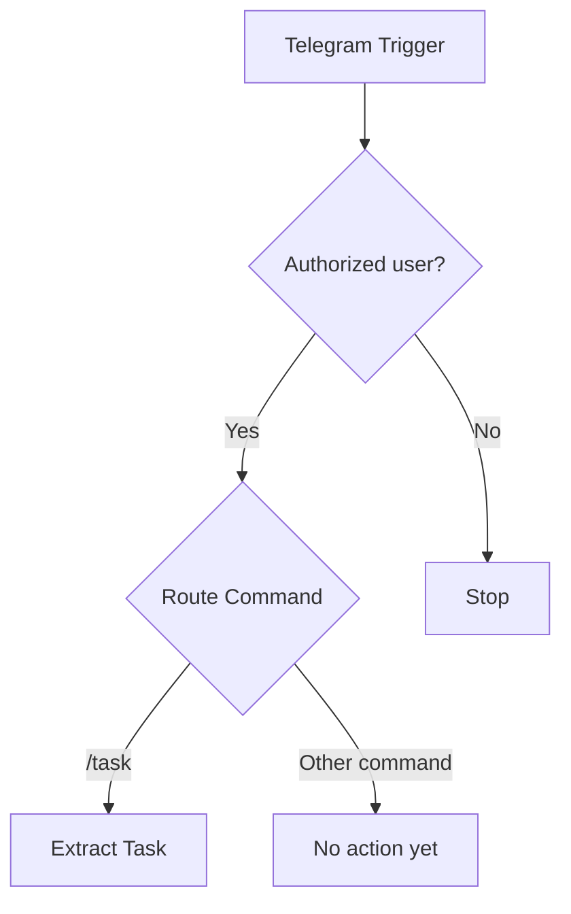
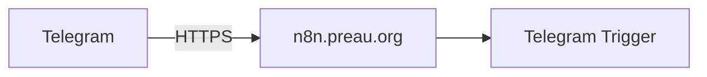
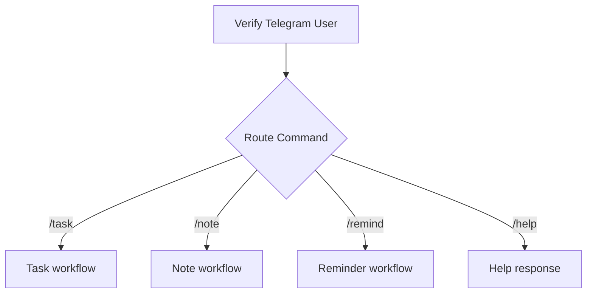
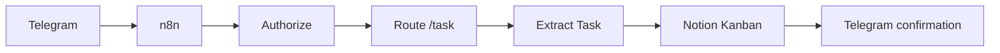

# Telegram command routing

With the public Telegram webhook working, I can now start building the first useful part of my automation platform.

At this stage, I deliberately keep things simple. I am not trying to understand natural language yet. Instead, I use explicit commands such as:

```text
/task Buy coffee
```

My goal is to reliably turn that Telegram message into structured data that I can later send to Notion.

## Current flow

The workflow now looks like this:



This gives each node a clear responsibility:

- **Telegram Trigger** receives the message.
- **Verify Telegram User** provides the minimal access control for my personal bot.
- **Route Command** decides what kind of request I sent.
- **Extract Task** converts the `/task` command into a clean task title.

## 1. Receiving a Telegram message

I configured a **Telegram Trigger** node using the credentials for my Telegram bot.

For the first test, I sent:

```text
Hello
```

n8n successfully received the Telegram event.

The payload included the information I need for the MVP, in particular:

```text
message.from.id
message.chat.id
message.text
```

This confirms that the complete path is working:



## 2. Restricting the bot to my Telegram account

The bot is personal, so I do not want another Telegram user to trigger my workflows.

Immediately after the Telegram Trigger, I added an **IF** node named:

```text
Verify Telegram User
```

The condition compares:

```text
{{ $json.message.from.id }}
```

with my authorized Telegram user ID.

I tested both branches:

- with my real ID, the workflow follows the **true** output;
- with a deliberately incorrect ID, the workflow follows the **false** output.

For the MVP, this is enough access control. I do not need a more elaborate authentication mechanism yet.

:::note

I keep the authorization check separate from command routing on purpose.

The first question is **"Is this user allowed?"**. Only after that do I ask **"What does this user want to do?"**.

This keeps security and application logic easy to understand.

:::

## 3. Routing commands with a Switch node

Initially, I considered adding another IF node to detect `/task`.

That would work, but it would become cumbersome as I add more commands.

Instead, I use a **Switch** node named:

```text
Route Command
```

This is essentially the n8n equivalent of a `switch` / `case` statement.

The Switch evaluates:

```text
{{ $json.message.text }}
```

For the first route, I configured a rule that recognizes messages starting with:

```text
/task 
```

The trailing space is intentional. It prevents something like `/taskfoo` from being treated as a valid `/task` command.

For now, there is only one useful route:

```text
/task → Extract Task
```

Later, without redesigning the workflow, I could add routes such as:

```text
/note
/remind
/help
```

The architecture could therefore evolve naturally into:



I am **not implementing these additional commands now**. They simply explain why I chose a Switch rather than a growing chain of IF nodes.

## 4. Extracting the task title

On the `/task` route, I added an **Edit Fields (Set)** node named:

```text
Extract Task
```

It creates a string field named:

```text
taskTitle
```

The value is calculated with this expression:

```javascript
{{ $json.message.text.replace(/^\/task\s+/, '').trim() }}
```

For example, this Telegram message:

```text
/task Buy coffee
```

produces:

```json
{
  "taskTitle": "Buy coffee"
}
```

The expression does two simple things:

1. removes `/task` and the whitespace immediately following it;
2. removes unnecessary whitespace around the remaining text.

The result is now independent from Telegram's command syntax and can be passed cleanly to the next system.

## What is working now

At this point, the Telegram side of the MVP can:

```text
Receive Telegram message
        ↓
Verify authorized user
        ↓
Recognize /task command
        ↓
Extract clean task title
```

For example:

```text
/task Buy coffee
```

becomes:

```text
taskTitle = Buy coffee
```

## Next step

The next boundary is **Notion**.

I already have an existing Notion Kanban database, so I do not want to invent a schema for it. The next step will be to connect n8n to Notion with minimal permissions, identify the correct database/data source and inspect its existing properties.

Only after that will I map `taskTitle` to the appropriate Notion property.

The target flow will then become:

