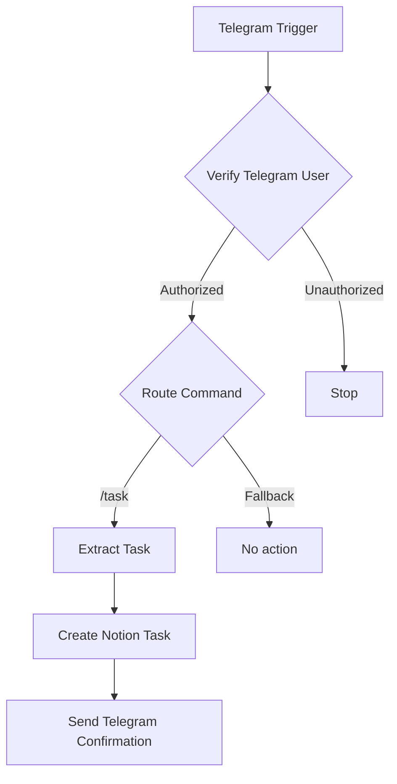

## 1. Connecting n8n to Notion

I created a dedicated internal Notion integration for n8n and gave it only the capabilities required for this workflow.

For this MVP, the integration needs to be able to:

- read the database information required by n8n;
- insert new content into my Kanban.

I stored the integration secret in an **n8n Notion credential** rather than directly in the workflow.

I then explicitly shared my existing Kanban with the integration. This is important because possessing a valid Notion integration token does not automatically mean that the integration can access every page in my workspace.

The n8n credential test completed successfully and my Kanban appeared in the available databases.

:::tip
I did not create a new Notion database for the automation. I connected n8n to my existing Kanban and let n8n discover its real properties before configuring the mapping.
:::

## 2. Creating the Notion task

I added a Notion node after `Extract Task`.

The important configuration is conceptually:

```text
Resource: Database Page
Operation: Create
Database: my existing Kanban
```

Once I selected the Kanban, n8n loaded its existing properties, including fields such as the task name, description, due date and swimlane.

For the MVP, I intentionally mapped only the minimum required field: the task name.

The Notion title property receives:

```text
{{ $json.taskTitle }}
```

I left the other Kanban properties untouched for now.

This means:

```text
/task Buy coffee
```

creates a new Kanban card whose name is:

```text
Buy coffee
```

No AI interpretation, due-date extraction or automatic categorization is involved yet.

## 3. Sending the confirmation back to Telegram

Finally, I added a Telegram node after the successful Notion creation.

The destination chat ID comes from the original Telegram Trigger event.

Conceptually, the confirmation uses:

```text
message.chat.id
```

from the initial Telegram message and sends a response such as:

```text
Task created: Buy coffee
```

This closes the loop: I immediately know that the command reached n8n and that the Notion creation step completed.

## Final workflow

The finished MVP is intentionally small:



Each node has one clear responsibility:

| Node | Responsibility |
|---|---|
| Telegram Trigger | Receive Telegram events |
| Verify Telegram User | Reject unauthorized users |
| Route Command | Select the appropriate command flow |
| Extract Task | Convert `/task ...` into a clean task title |
| Create Notion Task | Add the task to my existing Kanban |
| Telegram Confirmation | Confirm successful creation |


## MVP acceptance test

The final end-to-end scenario is now working:

```text
1. I send: /task Buy coffee
2. Telegram sends the event to n8n over HTTPS
3. n8n verifies my Telegram user ID
4. the Switch recognizes /task
5. n8n extracts "Buy coffee"
6. n8n creates the task in my Notion Kanban
7. the bot confirms the creation in Telegram
```

This completes the MVP.

## What I am deliberately not adding yet

I am stopping here rather than immediately turning a working MVP into an infrastructure project.

The following belong to later iterations:

- natural-language understanding with an LLM;
- due-date extraction;
- additional Telegram commands;
- richer Notion property mapping;
- better unsupported-command responses;
- error handling and retries;
- monitoring and centralized logs;
- backup strategy;
- CI/CD;
- infrastructure hardening and industrialization.

The important milestone is simpler: **I now have a real, end-to-end personal automation running from Telegram to n8n to Notion and back to Telegram.**